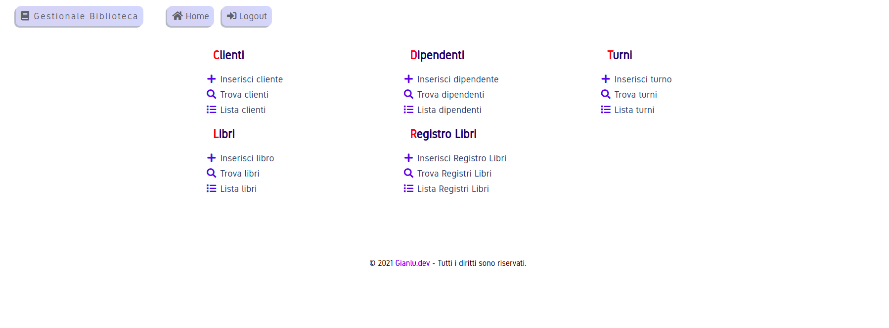
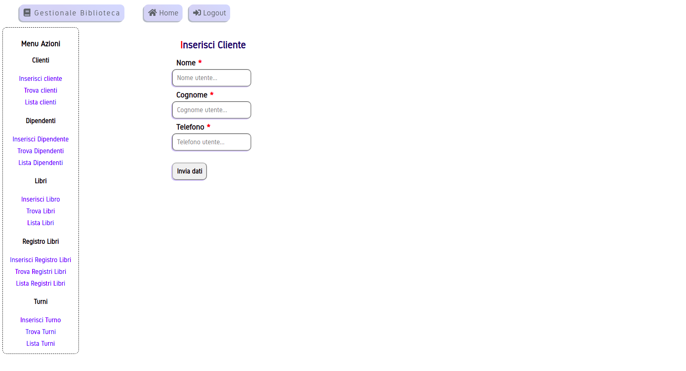

# Progetto Java Web App Gestionale Biblioteca 

Progetto esemplificativo con backend Java. \
Backend collegato con [GianluDeveloper/EWalletBiblioteca](https://github.com/GianluDeveloper/EWalletBiblioteca/) 

Tecnologie usate:
- Servlet Java JBoss/Wildfly
- WebService SOAP
- Servlet Jersey REST API
- JDBC
- JSTL
- MySQL
- Docker & Docker-Compose
- CSS3 & CSS Grid
- Javascript fetch API

Per eseguire il progetto (richiede [Docker](https://www.docker.com/get-started)):
```
git clone https://github.com/GianluDeveloper/BibliotecaJavaWeb/

cd ./BibliotecaJavaWeb

docker-compose build

docker-compose up 
```

Esempio live:
<https://gianlu.dev/JavaBiblioteca/>

***



***


